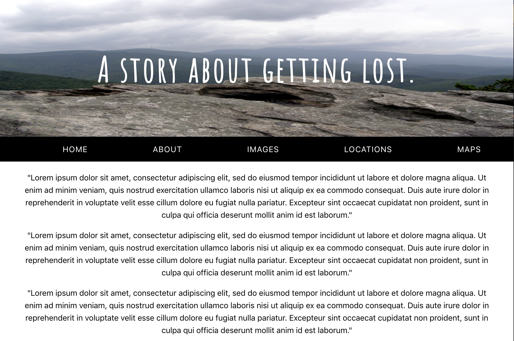
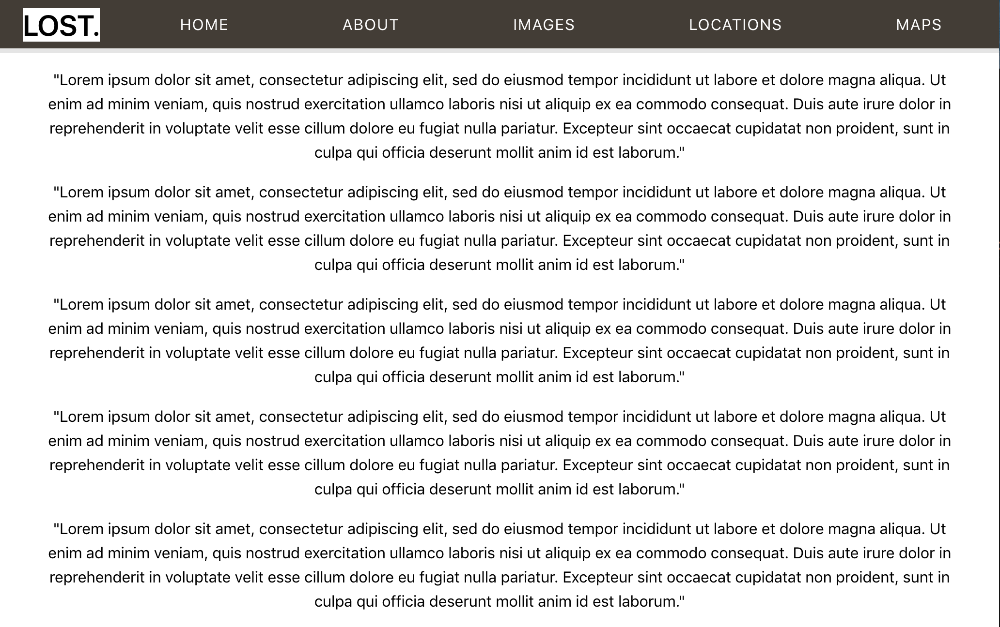

# Sticky Nav
A website made with create-react-app to create a sticky navigation bar. When the user scrolls down, the navigation bar changes into a sticky nav and is displayed on the screen at all times. The logo is also displayed in the nav.

## Main Page Screenshot: Regular Navigation Bar

## Screenshot: Sticky Navigation Bar (as user continues to scroll down)

